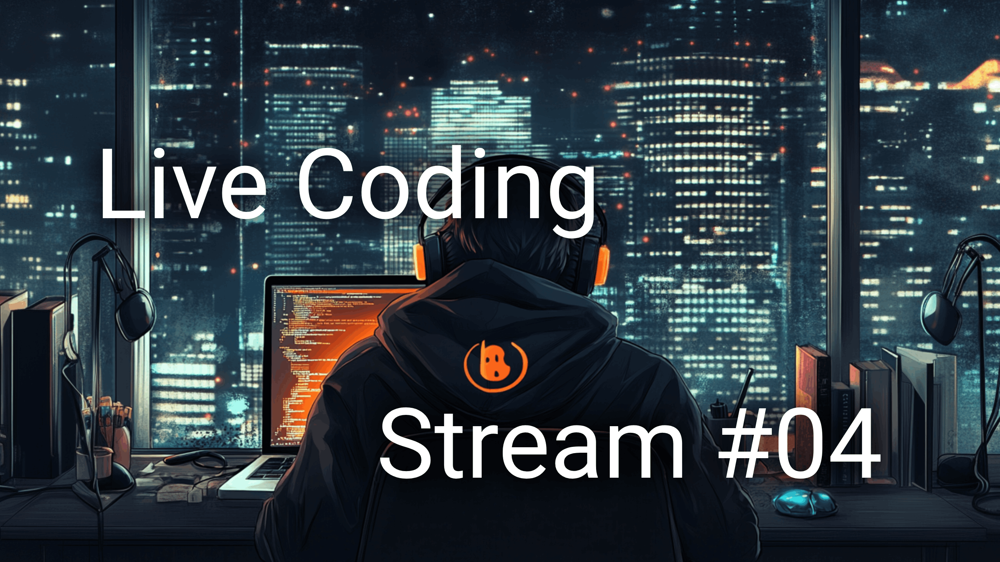

# 🎮 Wordle Clone — Live Coding Edition

Це невеликий pet-проєкт, створений у рамках [лайвкодинг стріму](https://youtube.com/live/cOdOsq2asaQ?feature=share) (посилання можна вставити пізніше).  
Мета — у невимушеній атмосфері зібрати клон гри **Wordle** з нуля, використовуючи **React + TypeScript + Vite**.


---

## 🧩 Про гру

> Вгадайте секретне слово з 5 літер за 6 спроб.

- 🟩 **Зелений** — правильна літера на правильному місці
- 🟨 **Жовтий** — літера є у слові, але не там
- ⬜ **Сірий** — літери в слові немає

Кожна спроба підсвічується, а клавіатура — оновлюється автоматично.

---

## 🛠️ Технології

- [React](https://react.dev/)
- [TypeScript](https://www.typescriptlang.org/)
- [Vite](https://vitejs.dev/)
- CSS (без фреймворків)

---

## 🚀 Швидкий запуск

```bash
git clone https://github.com/leva13007/livecoding-wordle.git
cd wordle-clone
npm install
npm run dev
```

Відкрий http://localhost:5173 у браузері

⸻

🧪 Мета проекту
* Покращити навички роботи з подіями клавіатури, стейтом, та логікою ігор
* Показати, як можна створити щось цікаве буквально з нуля
* Поспілкуватися зі спільнотою під час стріму 🎙️

⸻

📬 Зворотній зв’язок

Маєш ідеї або хочеш щось покращити? PR-и і пропозиції — дуже вітаються!
